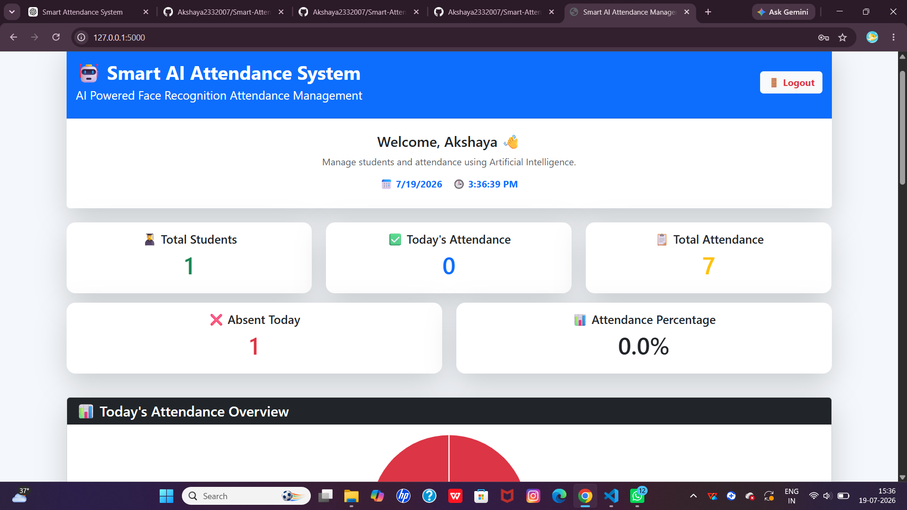
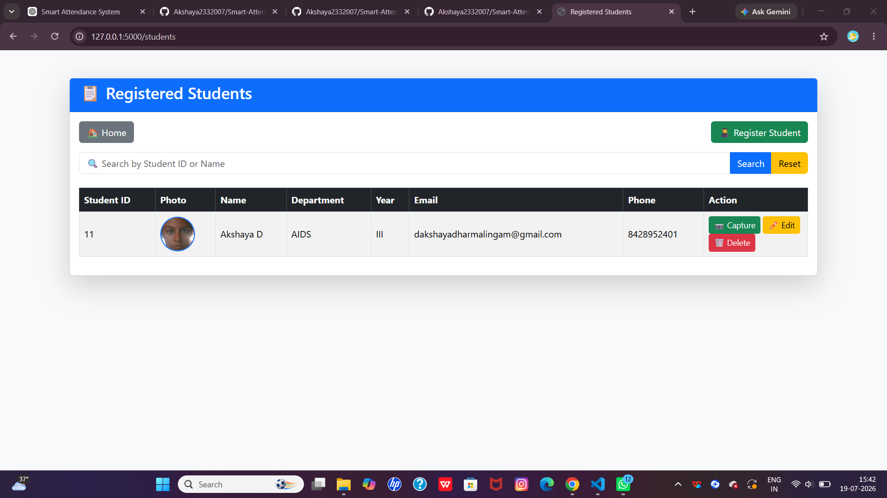
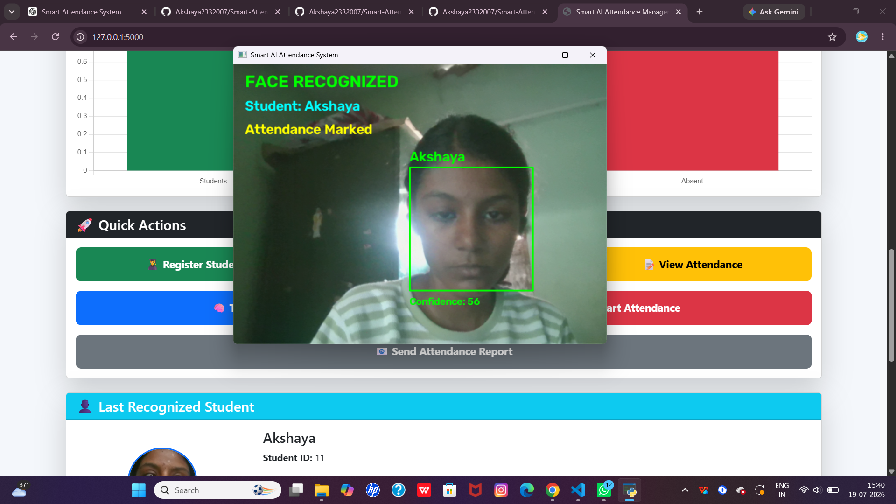

# 🎓 Smart Attendance Management System using Face Recognition

A Smart AI-based Attendance Management System that uses **Face Recognition** and **Blink Detection** to automatically mark attendance while preventing spoofing attacks.

---

## 📖 Project Overview

This project automates student attendance using Artificial Intelligence. The system captures a student's face, verifies liveness using blink detection, recognizes the student, and stores attendance records in an SQLite database. Attendance reports can also be exported to Excel.

---

## ✨ Features

- 👤 Student Registration
- 📷 Face Image Capture
- 🧠 Face Recognition using OpenCV
- 👁️ Blink Detection (Liveness Detection)
- ✅ Automatic Attendance Marking
- 📊 Dashboard with Attendance Statistics
- 📑 Attendance Report Generation (Excel)
- 🗄️ SQLite Database
- 🌐 Flask Web Application

---

## 🛠️ Technologies Used

| Technology | Purpose |
|------------|---------|
| Python | Backend Programming |
| Flask | Web Framework |
| OpenCV | Face Recognition |
| MediaPipe | Blink Detection |
| SQLite | Database |
| HTML/CSS | Frontend |
| JavaScript | Client-side Functionality |
| OpenPyXL | Excel Report Generation |
| NumPy | Numerical Operations |

---

## 📂 Project Structure

```
Smart-Attendance-System/
│
├── backend/
├── database/
├── dataset/
├── exports/
├── models/
├── reports/
├── screenshots/
├── static/
├── templates/
│
├── app.py
├── database.py
├── config.py
├── requirements.txt
└── README.md
```

---

## ⚙️ Installation

### Clone Repository

```bash
git clone https://github.com/Akshaya2332007/Smart-Attendance-management-system-using-face-recognization.git
```

### Go to Project Folder

```bash
cd Smart-Attendance-management-system-using-face-recognization
```

### Create Virtual Environment

```bash
python -m venv .venv
```

### Activate Virtual Environment

Windows

```bash
.venv\Scripts\activate
```

### Install Dependencies

```bash
pip install -r requirements.txt
```

### Run the Project

```bash
python app.py
```

Open your browser:

```
http://127.0.0.1:5000
```

---

# 📸 Screenshots

### Dashboard



---

### Student Registration



---

### Face Recognition



---

### Attendance Report


---

## 🚀 Future Enhancements

- Email Attendance Reports
- Cloud Database
- Mobile Application
- QR Code Attendance
- Multi-Face Recognition
- Face Mask Detection

---

## 👩‍💻 Author

**Akshaya**

B.Tech Artificial Intelligence & Data Science

GitHub: https://github.com/Akshaya2332007

---

## ⭐ Support

If you found this project helpful, please consider giving it a ⭐ on GitHub!